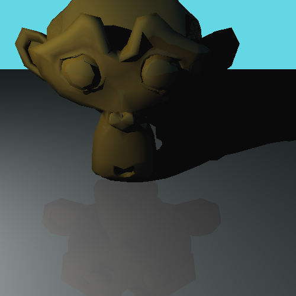
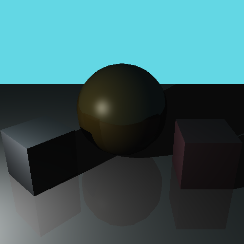
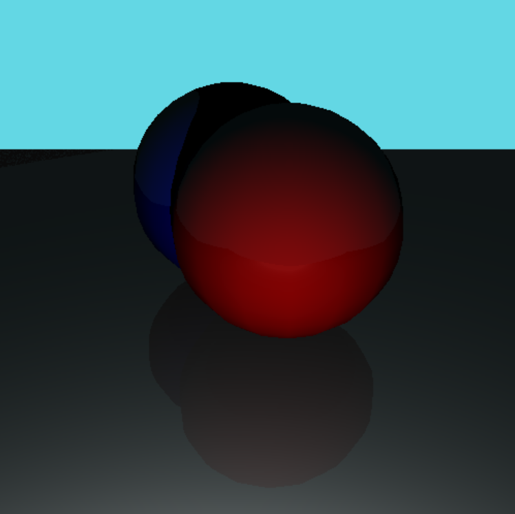

# Python Raytracer

My attempt at writing a bare-bones raytracer with Python.

Uses AABB testing, but no acceleration structures. Each ray is processed on a separate thread.

Uses .stl files.

Example Outputs:

